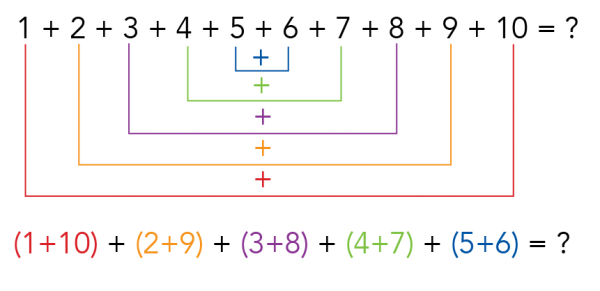

### Secret message

Write a function `find_secret_message(text)` that accepts a `text`, and finds all characters that directly follow the letter `'p'`. The function should return a list containing these characters.

    text = 'Apophenia is not paranoia, it requires sharpness of mind and patience.'
    family = find_secret_message(text)
    print(f"The secret message is: {family}")

Should print:

    The secret message is: ['o', 'h', 'a', 'n', 'a']

### Gaussian sum

Johann Karl Friedrich Gauss famously outsmarted one of his teacher at a the age of 10, when the teacher asked for the sum of all the numbers 1 to 100. He came up with a general method to solve this for a (even length) sequence of $n$ numbers, which is:

$$\text{total_sum} = \frac{n}{2}(n+1)$$

This works because we can take $\frac{n}{2}$ different pairs of numbers and each pair should sum up to $n+1$, like so:

Write the function `check_pairs(n)` that takes as input an even number $n$, generates the list from `1` to `n` (inclusive), and checks if all $\frac{n}{2}$ possible pairs do indeed sum to $n + 1$. The function should return `True` if Gauss' definition works for all the $\frac{n}{2}$ pairs in the sequence and `False` otherwise

### Speech synthesis

A number can be divided into digits. For example, the number 423 consists of the digits 4, 2 and 3. We want to use a speech synthesizer to pronounce numbers, digit by digit. So the number 423 should be pronounced as "four", "two", "three". Write a function `number_speech(number)` that accepts a number as an argument, and splits the number into separate digits. The function should return the separate digits as a list, and the result can then be printed as follows:

    number_list = number_speech(1903)
    for number in number_list:
        print(number)

Which should print the following:

    one
    nine
    zero
    three

**Hint:** remember that you can access the individual characters in a _string_ in the same way you can get the individual elements from a list.

### Booklist

For school, you are required to read books from a prescribed booklist. Instead of asking you to read at least 5 books from that list, the teacher asks you to read at least 1000 pages. Of course, even though you are an eager student, you don't want to read way too much. Write a function `count_pages(books_page_count, read_books)` that, given a dictionary of books (with the title of the book as a key, and the number of pages in that book as value) and a list of titles you have read, can calculate the total number of pages in the books that you have read. The function doesn't need to take into account invalid book titles.

    books_page_count = {'Nineteen Eighty-Four': 328, 'The Very Hungry Caterpillar': 22, 'Gulliver\'s Travels': 352, 'Frankenstein': 280, 'David Copperfield': 624, 'Moby-Dick': 736, 'Ulysses': 730, 'Lord of the Flies': 224, 'To Kill a Mockingbird': 281, 'The Picture of Dorian Gray': 272,'The Hobbit': 310}

    read_books = ['The Very Hungry Caterpillar', 'The Hobbit', 'Frankenstein', 'Lord of the Flies']

    page_total = count_pages(books_page_count, read_books)
    print(f'The books {read_books} have {page_total} pages in total.')

Should print:

    The books ['The Very Hungry Caterpillar', 'The Hobbit', 'Frankenstein', 'Lord of the Flies'] have 836 pages in total.

### Expense

You're writing a program that keeps track of your expenses. You're using a dictionary that keeps track of the monthly expenses in euros per category (_food_, _rent_, _internet_, _utilities_, _social activities_, etc.). Now you would like to know what percentages of you monthly expenses these categories represent.

Write a function  `euros_to_percentage(expenses)` that accepts a dictionary containing the expenses in euros. It should create a new dictionary containing the expenses in percentages.

Have a look a this example:

    expenses_january_in_euros = {'rent': 735, 'utilities': 221,
                                 'food': 167, 'social activities': 185,
                                 'internet + netflix + spotify': 58, 'phone': 25}
    expenses_january_in_percentages = euros_to_percentage(expenses_january_in_euros)
    print(expenses_january_in_percentages)

This should produce the output:

    {'rent': 52.83968368080517, 'utilities': 15.88785046728972, 'food': 12.005751258087706, 'social activities': 13.299784327821712, 'internet + netflix + spotify': 4.169662113587347, 'phone': 1.7972681524083394}

**Note:** the order in which this result is printed does not need to be the same as the example above. Check whether each category has the right value. If this is the case, your code probably works!

### Finish the booklist

Write a new function named `done_reading(books_page_count, read_books)`. Using the `count_pages` function from before, check if the list total of the books meets the 1000 page requirement. If this is the case, the function should print `"Total pages is {total}. All done"`. If not, find the single shortest book that would put the total over 1000 and recommend that to the user.

    done_reading(books_page_count, ['The Picture of Dorian Gray'])
    done_reading(books_page_count, ['Nineteen Eighty-Four', 'Gulliver\'s Travels', 'The Hobbit'])

Should output:

    Your current total is 272. Read Ulysses of 730 pages to complete your list.
    Your current total is 990. Read The Very Hungry Caterpillar of 22 pages to complete your list.
